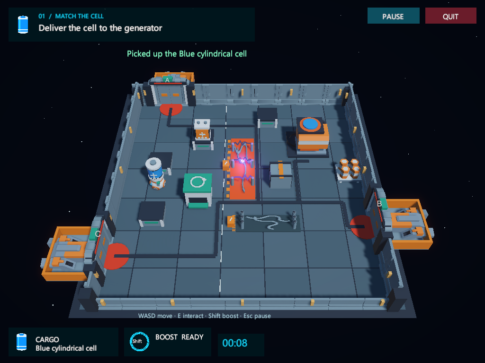
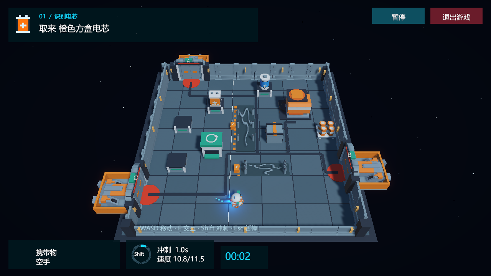
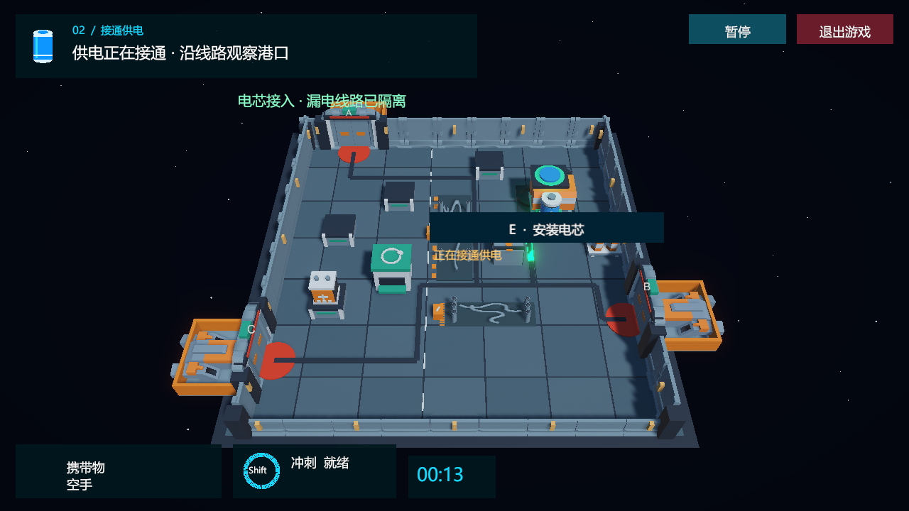
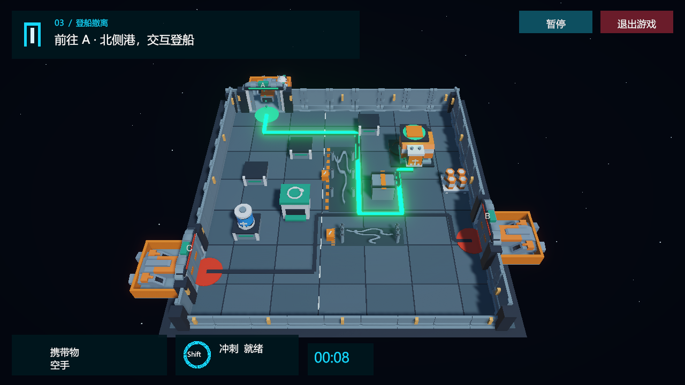

# Station Rescue: M-07

[中文](README.md) | **English**

A small Unity 3D game about carrying batteries and restoring power. A blackout traps maintenance robot M-07 in a cargo station. Find the matching battery, restart the emergency generator, and evacuate through the rescue dock selected for this run.

**Course release A1.0 · Unity 6000.6.4f1 · Windows · Chinese / English in-game menus**

## Gameplay

**Identify the battery → carry it magnetically → restore power → interact to board at the selected dock.**

- Each run selects a blue cylindrical or orange box-shaped battery, its shelf positions, and one rescue dock.
- The spherical body rolls, the head turns toward movement, and carried cargo stays upright. Boosting adds a visible thruster flame, trail, and cooldown feedback.
- Picking up, returning, installing, and boarding require E or the nearby action button.
- Damaged cables discharge periodically. A shock briefly stuns the robot, drops its battery, and adds time; retrieve the battery during a safe interval.
- Installing the correct battery starts the generator, sends green energy along the selected route, and opens its airlock.
- Change language in the main or pause menu. The game remembers your selection.

## Controls

- **WASD / arrow keys:** move.
- **Shift:** one impulse boost, with a 1.1-second cooldown.
- **E / nearby action button:** pick up, return, install, or board.
- **Esc:** pause, help, language selection, or return to the menu.
- **R:** start a new task. Quit buttons are available in the menu and gameplay.

Approaching a device does not perform its interaction. Walking through an opened airlock does not finish the mission; interact near its green boarding marker to evacuate.

## Screenshots

These images were captured from the actual Windows build.

View boosting, power restoration, and the boarding platform

**Thruster boost**

**Power restoration**

**Safe boarding platform**

## Open the source in Unity

1. Install **Unity 6000.6.4f1**. Add Windows Build Support when building the Windows player.
2. In Unity Hub, choose Projects → Add project from disk and select this repository root. The current local path is `D:\station-rescue-m07`.
3. Allow Unity to import assets and resolve the locked package dependencies.
4. Open `Assets/Scenes/Menu.unity`, press Play, then select Start game.

The repository includes complete `Assets`, `Packages`, and `ProjectSettings` directories. Unity generates Library and other caches on first import.

## Windows build

The complete course Windows package is supplied separately. Its local delivery copy is `LocalDeliverables/Course-A1.0/StationRescue-A1.0-Windows.zip`; this directory is excluded from source commits. Extract it, open `StationRescueV2_1`, and run `StationRescue.exe`. Keep its DLLs, Data directory, and other runtime files together.

To build from source, use **UnityAgentLab → Build Station Rescue Windows** in the editor. It builds the saved Menu / Game scenes; use Unity Build Profiles if you need another output location. The packaged Windows game runs without Unity Editor or an AI service.

## Current status

**A1.0 freezes the verified course game, corresponding to development revision V2.1.** It includes movement, collisions, battery Prefabs, an AddForce impulse boost, the complete repair mission, live UI, sound, menus, pause, restart, and language selection.

- Existing Editor regression: **317 checks passed**.
- Existing Windows build and extracted package: **176 checks passed each**.
- Existing clean Git clone: first Unity import, compilation, and **317 regression checks passed**.
- Coverage includes a synthetic-WASD delivery mission and all three opened docks, their support and guardrails, returning to the marker, and manual boarding. Some focused state checks use controlled positioning; this is game validation, not a visual AI agent.

Reports are in [docs/validation](docs/validation), with snapshot metadata in [docs/release.json](docs/release.json). The [two-page post-mortem](docs/post-mortem.pdf) describes the open-airlock fall and its fix; the student must review it before course submission.

Planned research: **B: Python control interface → C: visual AI gameplay → D: memory and replanning experiments**. These features are not implemented yet; the detailed [AI roadmap](docs/ai-roadmap.html) is currently in Chinese.

## Repository and reusable tools

- `Assets/Scenes`: menu, game, and preserved earlier scenes.
- `Assets/Scripts` / `Assets/Editor`: gameplay, scene upgrades, building, and validation.
- `Assets/ThirdParty`: imported assets, original license notices, and source records.
- `docs`: actual screenshots, validation reports, post-mortem, and research roadmap.
- [DesignKit](DesignKit/README.md): an offline game-design workbench, idea JSON, development prompts, lessons, and a portable Skill. Open `DesignKit/index.html` locally; the workbench is currently in Chinese.
- [examples/browser-prototype](examples/browser-prototype/README.md): the separate 2D browser prototype present when this repository was created.
- `LocalDeliverables`: local course submission materials, excluded by Git.

Open the root `index.html` for the project introduction with Chinese / English switching. Run the Unity game using the Editor or Windows instructions above.

## Assets and development

Kenney Space Kit and Modular Space Kit assets use **CC0**. Original notices and source records are preserved in their ThirdParty directories. The project supplies its robot, batteries, interaction devices, UI, and audio. See [asset credits](docs/ASSETS.md).

The project author provided the concept and playtest feedback; implementation, debugging, and documentation were assisted by AI. Follow the instructor's disclosure and usage rules for course submission. Third-party notices apply to their respective assets and do not license the entire repository.
