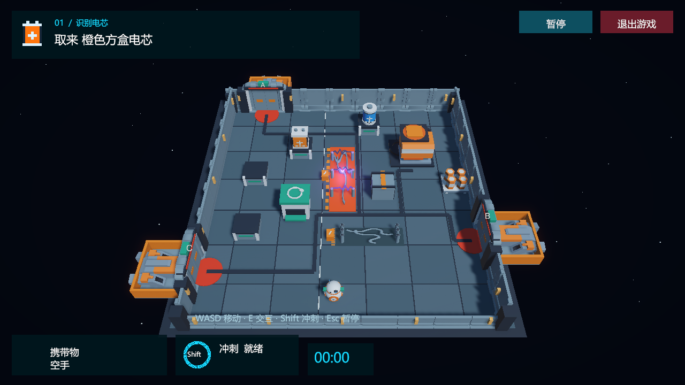

# 停电救援：M-07

**中文** | [English](README.en.md)

一款小型 Unity 3D 搬运与维修游戏。货运站停电后，维修机器人 M-07 必须找到匹配电芯、启动应急发电机，再从本局开放的救援港口撤离。

**课程版 A1.0 · Unity 6000.6.4f1 · Windows · 游戏内支持中文 / English**

## 游戏怎么玩

**识别电芯 → 磁吸搬运 → 恢复供电 → 随机港口手动登船。**

- 每局选择蓝色圆柱或橙色方盒电芯，并改变电芯架位与开放港口。
- 球身滚动、头部朝移动方向转动，携带物保持直立；冲刺带尾焰、拖尾与冷却反馈。
- 拾取、归还、安装和登船都需要按 E 或点击附近的动作按钮。
- 裸露电缆周期放电；触电会短暂失速、掉落电芯并加时，停歇后可重新捡起。
- 安装正确电芯后，发电机启动，绿色能量沿线路传播，选中的气闸开启。
- 菜单与暂停页可以切换中英文，语言选择会保存。

## 操作

- **WASD / 方向键**：移动。
- **Shift**：单次冲刺，冷却 1.1 秒。
- **E / 附近动作按钮**：拾取、归还、安装、登船。
- **Esc**：暂停、帮助、切换语言或返回菜单。
- **R**：开始新任务。菜单与游戏中均提供退出按钮。

靠近设备不会自动完成交互。走出开启的气闸也不会自动通关；在绿色登船标记附近交互即可撤离。

## 截图

以下图片均来自实际 Windows 程序运行。

查看冲刺、通电与撤离画面

**推进器冲刺**

**恢复供电**

**安全登船平台**

## 用 Unity 打开源码

1. 安装 **Unity 6000.6.4f1**；构建 Windows 版时准备 Windows Build Support。
2. Unity Hub → Projects → Add project from disk，选择仓库根目录。本机路径为 `D:\station-rescue-m07`。
3. 等待 Unity 导入素材并解析锁定的包依赖。
4. 打开 `Assets/Scenes/Menu.unity`，点击 Play，然后点“开始游戏”。

仓库包含完整的 `Assets`、`Packages` 与 `ProjectSettings`。首次打开会生成 Library 等缓存。

## Windows 版与构建

课程 Windows 完整包单独提供。本机交付副本在 `LocalDeliverables/Course-A1.0/StationRescue-A1.0-Windows.zip`，该目录不进入源码提交。解压后进入 `StationRescueV2_1`，运行 `StationRescue.exe`，保留同目录的 DLL、Data 文件夹和其他运行文件。

从源码构建：Unity 编辑器菜单 → **UnityAgentLab → Build Station Rescue Windows**。构建使用已保存的 Menu / Game 场景；若需要更换输出位置，可在 Unity 的 Build Profiles 中配置。已打包的 Windows 版无需安装 Unity 或连接 AI 服务。

## 当前完成到哪

**A1.0 是已验证的课程游戏快照，对应开发修订 V2.1**。包含移动、碰撞、Prefab 电芯、AddForce 冲刺、完整维修任务、实时 UI、声音、菜单、暂停、重开与语言切换。

- 既有 Editor 回归：**317 项通过**。
- 既有 Windows 主程序与解压包：**各 176 项通过**。
- 既有干净 Git clone：首次 Unity 导入、编译与 **317 项回归通过**。
- 覆盖一次实际模拟 WASD 搬运任务，以及三个开启港口的平台、护栏、回程与手动登船。部分状态检查采用受控定位；这些是游戏验收，尚不是视觉 AI 玩家。

检查记录在 [docs/validation](docs/validation)，快照信息在 [docs/release.json](docs/release.json)。[两页问题复盘](docs/post-mortem.pdf)聚焦“开门后跌出平台”的修复，提交课程前仍需本人复核。

后续研究：**B：Python 控制接口 → C：视觉 AI 看图行动 → D：记忆与重规划对照实验**。这些功能尚未实现；详见 [AI 路线说明](docs/ai-roadmap.html)。

## 项目目录与复用工具

- `Assets/Scenes`：菜单、游戏及保留的早期场景。
- `Assets/Scripts` / `Assets/Editor`：游戏逻辑、场景升级、构建与验收入口。
- `Assets/ThirdParty`：所用素材、原始授权与来源记录。
- `docs`：实际截图、验收报告、复盘和研究路线。
- [DesignKit](DesignKit/README.md)：游戏设计工作台、构思 JSON、开发 Prompt、经验与可携带 Skill。双击 `DesignKit/index.html` 本地使用。
- [examples/browser-prototype](examples/browser-prototype/README.md)：建仓时已有的二维浏览器小样，保留作独立示例。
- `LocalDeliverables`：本机课程交付文件，Git 忽略。

双击根目录 `index.html` 可以打开中英切换的项目介绍页；Unity 游戏按上面的 Editor 或 Windows 方法运行。

## 素材与开发说明

Kenney Space Kit 与 Modular Space Kit 使用 **CC0** 素材，原始授权和来源保存在对应 ThirdParty 目录；机器人、电芯、交互设备、UI 与音效由本项目制作。详见 [素材来源](docs/ASSETS.md)。

构思与试玩反馈由项目作者提供；实现、调试和文档使用 AI 辅助。课程提交的披露与使用范围按教师要求处理。保留的第三方声明仅适用于对应素材，不代替整个仓库的授权。
